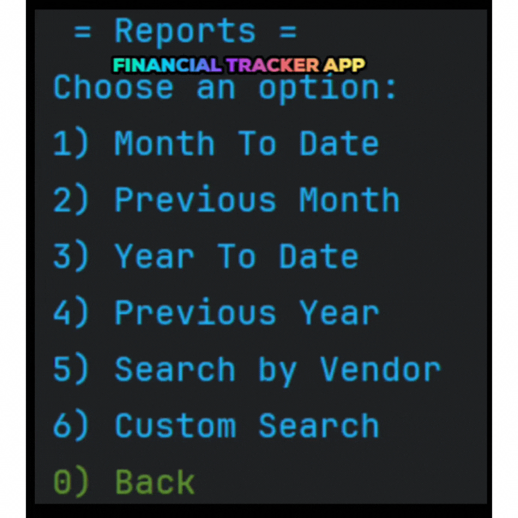
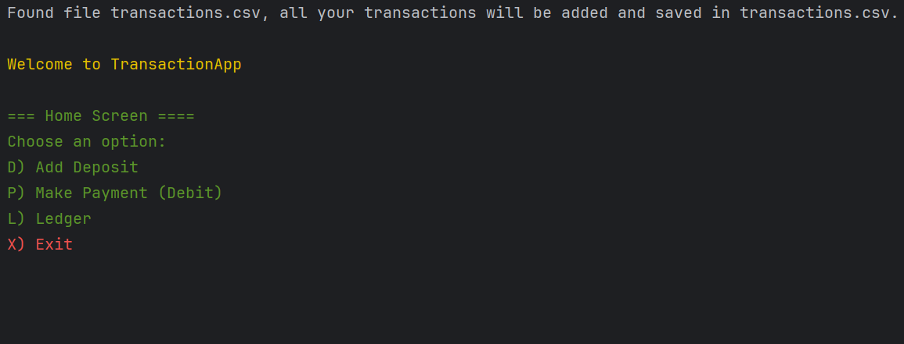

# Financial Tracker

## Description of the Project

This Java CLI application lets users track all financial transactions for personal or business use.
Transactions are stored in a single file (transactions.csv) and include date, time, description, vendor, and amount.

Users can add deposits or make payments while choosing to manually enter the date and time or automatically use the
current timestamp.
The ledger screen displays transactions newest first and allows filtering by deposits, payments, or running pre-defined
and custom reports (e.g., month-to-date, previous year, or by vendor).

Designed for anyone who wants a simple, reliable way to manage financial records without complex accounting software.

## User Stories

List the user stories that guided the development of your application. Format these stories as: "As a [type of user], I
want [some goal] so that [some reason]."

- As a user, I want to have access to the home screen until I choose to exit the application,
  so that I can continue using the application for multiple tasks without restarting it each time.

- As a user, I want all entries to show the newest entries (date & time) first in the ledger,
  so that I can view transactions in order.

- As a user, I want all transactions in the application to be read from and saved to a file named "transactions.csv",
  so that I can view and maintain a complete transaction history in one place.

- As a user, I want to be able to add new deposit information and save it to the CSV file,
  so that I can keep a record of all my deposit transactions.

- As a user, I want to be able to add payment (debit) information and save it to the CSV file,
  so that I can keep a record of all my payment transactions.

- As a user, I want to be able to view reports with custom searches on my transactions,
  so that I can easily find my transaction activity based on specific time periods or vendors.

- As a user, I want to have options on the Ledger screen to view all my transactions in different ways,
  so that I can easily review my transactions by category, date range, or vendor.

## Setup

Instructions on how to set up and run the project using IntelliJ IDEA.

### Prerequisites

- IntelliJ IDEA: Ensure you have IntelliJ IDEA installed, which you can download
  from [here](https://www.jetbrains.com/idea/download/).
- Java SDK: Make sure Java SDK is installed and configured in IntelliJ.

### Running the Application in IntelliJ

Follow these steps to get your application running within IntelliJ IDEA:

1. Open IntelliJ IDEA.
2. Select "Open" and navigate to the directory where you cloned or downloaded the project.
3. After the project opens, wait for IntelliJ to index the files and set up the project.
4. Find the main class with the `public static void main(String[] args)` method.
5. Right-click on the file and select 'Run 'YourMainClassName.main()'' to start the application.

## Technologies Used

- Java: JDK corretto-17 Amazon Corretto 17.0.16
  Build system: Maven
- IntelliJ IDEA 2025.2.1 (Community Edition)

## Demo

Include screenshots or GIFs that show your application in action.

## Future Work

Outline potential future enhancements or functionalities you might consider adding:

- Additional feature to be developed.
- Improvement of current functionalities.

## Resources

List resources such as tutorials, articles, or documentation that helped you during the project.

- [Java date](https://beginnersbook.com/2013/05/java-date/)
- [How to Sort List by Date in Java 8 Article](https://javatechonline.com/how-to-sort-list-by-date-in-java-8/)
- [File exists() method in Java with examples](https://www.geeksforgeeks.org/java/file-exists-method-in-java-with-examples/)
- [Create File if not exists in Java ](https://www.w3docs.com/snippets/java/java-fileoutputstream-create-file-if-not-exists.html#:~:text=To%20create%20a%20file%20using,file%20file%2Dio%20new%2Doperator)
- [Get First Date of Current Month in Java](https://www.baeldung.com/java-current-month-start-date)
- [Class LocalDate Methods](https://docs.oracle.com/javase/8/docs/api/java/time/LocalDate.html)

## Team Members

- **Qi Qing Lin**

## Thanks

- I would like to sincerely thank my instructor Raymon Maroun for providing the project skeleton code and for
  their continuous guidance and support throughout the development process.

- also wish to acknowledge my peers — Roger Su, Mohammad Hussain, Andy Wu, Monalisa Stimphil, and Stephen Anku —
  for their brief but helpful assistance during the project.
